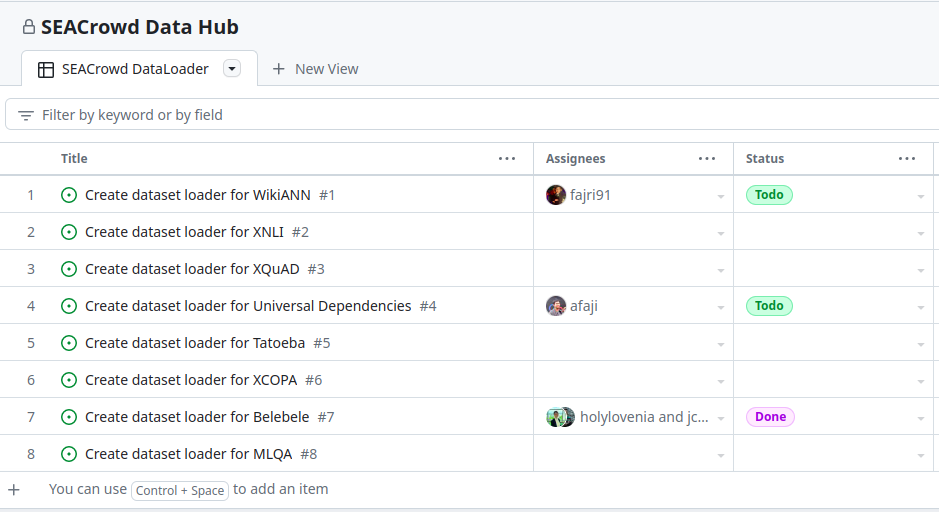
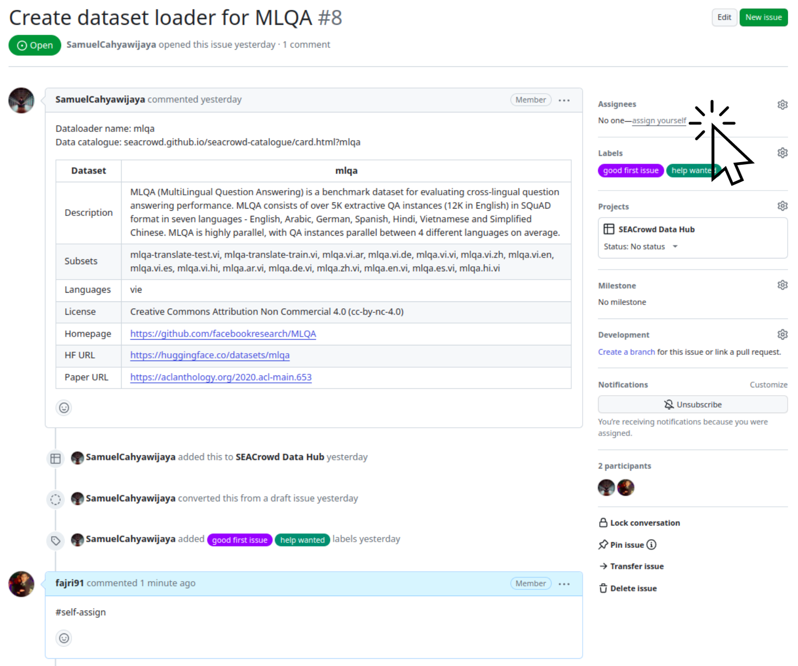

# Guideline for contributing a dataloader implementation

## Pre-Requisites

Please make a GitHub account prior to implementing a dataset; you can follow the instructions to install git [here](https://git-scm.com/book/en/v2/Getting-Started-Installing-Git).

You will also need at least Python 3.6+. If you are installing Python, we recommend downloading [anaconda](https://docs.anaconda.com/anaconda/install/index.html) to curate a Python environment with the necessary packages. **We strongly recommend Python 3.8+ for stability**.

**Optional** Setup your GitHub account with SSH ([instructions here](https://docs.github.com/en/authentication/connecting-to-github-with-ssh).)

### 1. **Assigning a dataloader**
- Choose a dataset from the [list of SEACrowd datasets](https://github.com/orgs/SEACrowd/projects/1/views/1).
<p align="center">
    
</p>

- Assign yourself an issue by commenting `#self-assign` under the issue. **Please assign yourself to issues with no other collaborators assigned**. You should see your GitHub username associated with the issue within 1-2 minutes of making a comment.

<p align="center">
    
</p>

- Search to see if the dataset exists in the 🤗 [Hub](https://huggingface.co/datasets). If it exists, please use the current implementation as the `source` and focus on implementing the [task-specific seacrowd schema](https://github.com/SEACrowd/seacrowd-datahub/blob/master/task_schemas.md).

- If not, find the dataset online, usually uploaded in Github or Google Drive.

### 2. **Setup a local version of the SEACrowd repo**
Fork the seacrowd-datahub [repository](https://github.com/SEACrowd/seacrowd-datahub) to your local Github account. To do this, click the link to the repository and click "fork" in the upper-right corner.

After you fork, clone the repository locally. You can do so as follows:

    git clone git@github.com:<your_github_username>/seacrowd-datahub.git
    cd seacrowd-datahub  # enter the directory

Next, you want to set your `upstream` location to enable you to push/pull (add or receive updates). You can do so as follows:

    git remote add upstream git@github.com:SEACrowd/seacrowd-datahub.git

You can optionally check that this was set properly by running the following command:

    git remote -v

The output of this command should look as follows:

    origin  git@github.com:<your_github_username>/seacrowd-datahub.git (fetch)
    origin  git@github.com:<your_github_username>/seacrowd-datahub.git (push)
    upstream    git@github.com:SEACrowd/seacrowd-datahub.git (fetch)
    upstream    git@github.com:SEACrowd/seacrowd-datahub.git (push)

If you do NOT have an `origin` for whatever reason, then run:

    git remote add origin git@github.com:<your_github_username>/seacrowd-datahub.git

The goal of `upstream` is to keep your repository up-to-date with any changes made officially to the datasets library. You can do this as follows by running the following commands:

    git fetch upstream
    git pull

Provided you have no *merge conflicts*, this will ensure the library stays up-to-date as you make changes. However, before you make changes, you should make a custom branch to implement your changes.

You can make a new branch as such:

    git checkout -b <dataset_name>

<p style="color:red"> <b> Please do not make changes on the master branch! </b></p>

Always make sure you're on the right branch with the following command:

    git branch

The correct branch will have an asterisk \* in front of it.

### 2. **Create a development environment**
You can make an environment in any way you choose. We highlight two possible options:

#### 2a) Create a conda environment

The following instructions will create an Anaconda `env-seacrowd-datahub` environment.

- Install [anaconda](https://docs.anaconda.com/anaconda/install/) for your appropriate operating system.
- Run the following command while in the `sea_datasets` folder (you can pick your python version):

```
conda env create -f conda.yml  # Creates a conda env
conda activate env-seacrowd-datahub # Activate your conda environment
```

You can deactivate your environment at any time by either exiting your terminal or using `conda deactivate`.

#### 2b) Create a venv environment

Python 3.3+ has venv automatically installed; official information is found [here](https://packaging.python.org/en/latest/guides/installing-using-pip-and-virtual-environments/).

```
python3 -m venv <your_env_name_here>
source <your_env_name_here>/bin/activate  # activate environment
pip install -r requirements.txt # Install this while in the datasets folder
```
Make sure your `pip` package points to your environment's source.

### 3. Implement your dataloader

Use this bash script to initialize your new dataloader folder along with template of your dataloader script under `SEACrowd/seacrowd-datahub/sea_datasets` directory using this:

    sh templates/initiate_seacrowd_dataloader.sh <YOUR_DATALOADER_NAME>
The value of `<YOUR_DATALODER_NAME>` can be checked on the issue ticket that you were assigned to.

i.e: for this [issue ticket](https://github.com/SEACrowd/seacrowd-datahub/issues/32), the dataloader name indicates `Dataloader name: xl_sum/xl_sum.py`, hence the value of `<YOUR_DATALOADER_NAME>` is `xl_sum`.

Please use PascalCase when choosing a `<dataset_name>`.
To implement your dataset, there are three key methods that are important:

  * `_info`: Specifies the schema of the expected dataloader
  * `_split_generators`: Downloads and extracts data for each split (e.g. train/val/test) or associate local data with each split.
  * `_generate_examples`: Create examples from data that conform to each schema defined in `_info`.

After the bash above has been executed, you'll have your `seacrowd/sea_datasets/<dataset_name>` directory existed with the name `<dataset_name>.py`. Within this file, fill out all the TODOs based on the template.

For the `_info_` function, you will need to define `features` for your
`DatasetInfo` object. For the `bigbio` config, choose the right schema from our list of examples. You can find a description of these in the [Task Schemas Document](task_schemas.md). You can find the actual schemas in the [schemas directory](seacrowd/utils/schemas).

You will use this schema in the `_generate_examples` return value.

Populate the information in the dataset according to this schema; some fields may be empty.

To enable quality control, please add the following line in your file before the class definition:
```python
from seacrowd.utils.constants import Tasks
_SUPPORTED_TASKS = [Tasks.NAMED_ENTITY_RECOGNITION, Tasks.DEPENDENCY_PARSING]
```

##### Example scripts:
To help you implement a dataset, you can see the implementation of [other dataset scripts](seacrowd/sea_datasets).

#### Running & Debugging:
You can run your data loader script during development by appending the following
statement to your code (if you have your dataloader folder initialized using previous bash script, it already includes this, else you may add these by yourself):

```python
if __name__ == "__main__":
    datasets.load_dataset(__file__)
```

If you want to use an interactive debugger during development, you will have to use
`breakpoint()` instead of setting breakpoints directly in your IDE. Most IDEs will
recognize the `breakpoint()` statement and pause there during debugging. If your prefered
IDE doesn't support this, you can always run the script in your terminal and debug with
`pdb`.


### 4. Check if your dataloader works

Make sure your dataset is implemented correctly by checking in python the following commands:

```python
from datasets import load_dataset

data = load_dataset("seacrowd/sea_datasets/<dataset_name>/<dataset_name>.py", name="<dataset_name>_seacrowd_<schema>")
```

Run these commands from the top level of the `seacrowd/seacrowd-datahub` repo (i.e. the same directory that contains the `requirements.txt` file).

Once this is done, please also check if your dataloader satisfies our unit tests as follows by using this command in the terminal:

```bash
python -m tests.test_seacrowd seacrowd/sea_datasets/<dataset_name>/<dataset_name>.py [--data_dir /path/to/local/data]
```

Your particular dataset may require use of some of the other command line args in the test script.
To view full usage instructions you can use the `--help` command,

```bash
python -m tests.test_seacrowd --help
```

### 5. Format your code

From the main directory, run the Makefile via the following command:

    make check_file=seacrowd/sea_datasets/<dataset_name>/<dataset_name>.py

This runs the black formatter, isort, and lints to ensure that the code is readable and looks nice. Flake8 linting errors may require manual changes.

### 6. Commit your changes

First, commit your changes to the branch to "add" the work:

    git add seacrowd/sea_datasets/<dataset_name>/<dataset_name>.py
    git commit -m "A message describing your commits"

Then, run the following commands to incorporate any new changes in the master branch of datasets as follows:

    git fetch upstream
    git rebase upstream/master

Or you can install the pre-commit hooks to automatically pre-check before commit by:

    pre-commit install

**Run these commands in your custom branch**.

Push these changes to **your fork** with the following command:

    git push -u origin <dataset_name>

### 7. **Make a pull request**

Make a Pull Request to implement your changes on the main repository [here](https://github.com/SEACrowd/seacrowd-datahub/pulls). To do so, click "New Pull Request". Then, choose your branch from your fork to push into "base:master".

When opening a PR, please link the [issue](https://github.com/SEACrowd/seacrowd-datahub/issues) corresponding to your dataset using [closing keywords](https://docs.github.com/en/issues/tracking-your-work-with-issues/linking-a-pull-request-to-an-issue) in the PR's description, e.g. `resolves #17`.
